# Codec Lab




A from-scratch image codec toolkit in C. Right now it converts between **BMP** and **JPEG**. More codecs are landing on top of the same core.

## Features

- BMP → JPEG
- JPEG → BMP

## Roadmap

- [ ] Motion JPEG (MJPEG)
- [ ] H.264 (baseline profile first)

## Usage

```bash
# BMP -> JPEG
lab image.bmp -o image.jpeg

# JPEG -> BMP
lab image.jpeg -o image.bmp
```

Direction is inferred from the **input file's extension** — `-o` only sets the output path/name. If your input doesn't have a `.bmp`/`.jpeg`/`.jpg` extension, this will not work as expected

## Build

```bash
shopt -s globstar extglob
gcc **/!(*_test).c -lm -I. -o main
```

## Test

The test data is not included in this repository because the files are
too large to store efficiently in Git.

#### Download

Download the test data archive from Google Drive:

[Download test data](https://drive.google.com/file/d/1_vOWM2WOJsSRBPlL6nS1Rs4s7nj9OHsO/view?usp=drive_link)

#### Installation

After downloading `test_data.tar.gz`, extract it into the project root directory:

```bash
tar -xzf test_data.tar.gz -C ./
rm test_data.tar.gz
shopt -s globstar
gcc **/*.c -lm -I. -g -DRUN_TEST -o main_test
```

## License

MIT — see [LICENSE](./LICENSE).
